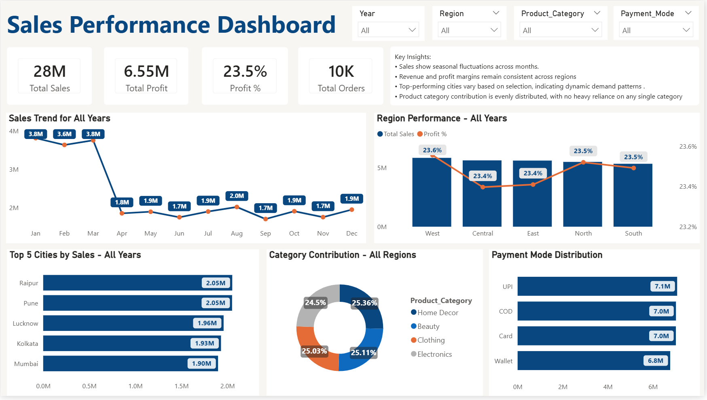

# Sales Performance Dashboard | Power BI

## 🔹 Overview  
This project focuses on transforming raw sales data into meaningful business insights using Power BI. The dashboard provides a comprehensive view of key performance indicators such as total sales, profit, order volume and category distribution.  

It enables stakeholders to explore trends across time, regions, cities and payment modes through an interactive and visually intuitive interface.

## 🔹 Objective  
An interactive Power BI dashboard built to analyze sales performance, profitability and customer trends across multiple business dimensions, enabling data-driven decision-making.

## 🔹 Business Problem 
Businesses often lack a centralized system to monitor sales performance across regions and categories, making it difficult to identify trends, optimize strategies and make informed decisions.  

This dashboard addresses that gap by providing a unified and interactive analytics solution.

## 🔹 Dataset  

- Source: Sales dataset (Excel)  

- Data includes:  
  - Transaction-level sales records  
  - Product categories  
  - Customer locations (city, region)  
  - Payment modes  
  - Order dates    

## 🔹 Tools and Technologies  

- Power BI – Dashboard development & visualization  
- Microsoft Excel – Data cleaning & preprocessing  
- DAX (Data Analysis Expressions) – KPI calculations & measures  
- Data Modeling – Relationship building and schema design  

## 🔹 Workflow  

### ✔ Data Cleaning & Preparation  
- Cleaned raw dataset in Excel  
- Standardized formats and handled inconsistencies  
- Ensured data accuracy by validating key metrics  

### ✔ Data Modeling  
- Created time-based columns (Year, Month)  
- Built calculated measures using DAX:  
  - Total Sales  
  - Total Profit  
  - Profit %  
  - Total Orders  

### ✔ Dashboard Development  
- Designed KPI cards for business overview  
- Implemented interactive slicers for dynamic filtering  
- Built visuals for trend and performance analysis  

## 🔹 Key Insights  

- Sales exhibit seasonal fluctuations, indicating demand patterns  
- Profit margins remain consistent (~23–24%) across regions  
- Revenue contribution is well distributed across categories  
- Certain cities drive higher revenue concentration  
- Digital payment methods (UPI) slightly dominate transactions  

## 🔹 Key Visuals  

- KPI Cards (Sales, Profit, Orders, Profit %)  
- Monthly Sales Trend (Line Chart)  
- Region-wise Performance (Bar + Line Chart)  
- Top Cities by Sales (Bar Chart)  
- Category Contribution (Donut Chart)  
- Payment Mode Distribution (Bar Chart)  

### 📸 Dashboard Preview  

## 🔹 Key Learnings  

- Hands-on experience with end-to-end data analytics workflow  
- Improved understanding of data modeling in Power BI  
- Learned to create business-focused KPIs & measures using DAX  
- Developed skills in dashboard design & storytelling  
- Gained insight into real-world sales analysis scenarios  

## 🔹 How to Run This Project  

1. Download the repository  
2. Open the `.pbix` file in Power BI Desktop  
3. Ensure the dataset path is correctly linked (if required)  
4. Interact with slicers to explore insights  

## 🔹 Author & Contact  

**Anshul Sajwan**  

- LinkedIn: https://www.linkedin.com/in/anshul-sajwan/
- Email: anshulsajwan018@gmail.com
